# Road_Segmemtation

# Introduction:

In recent years, growing research interest is witnessed in automated driving systems (ADS) and advanced driverassistance systems (ADAS). As one of the essential modules, road segmentation perceives the surroundings, detects the drivable region and builds an occupancy map. A drivable region is a connected road surface area that is not occupied by any vehicles, pedestrians, cyclists or other obstacles. In the ADS workflow, road segmentation contributes to other perception modules and generates an occupancy map for planning modules. Therefore, an accurate and efficient road segmentation is necessary. Camera-based road segmentation has been investigated for decades since cameras generate high-resolution frames frequently and they are cost effective. Traditional computer vision algorithms employed manually defined features such as edges and histogram for road segmentation. Those features, however, worked on limited situations and were difficult to extend to new scenarios. Convolutional neural network (CNN) based algorithms attracted research interest in recent years. By implementing massive convolutional kernels to a deep neural network, CNNs are capable to handle various driving scenarios. Existing CNN based road segmentation algorithms such as FCN, SegNet, StixelNet, Up-conv-Poly and MAP generated a precise drivable region but required large computational. Table II presents their performance on KITTI road benchmark  as well as their parameter counts, floating-point operations and running time for each frame processing. Recent research proposed several efficient networks and network structures such as MobileNet and Xception.
So, here, is the road segmentation work on basis of FCN.

This repo contains work of my intern at Changwon Natioanl University, South Korea. More detail can be found here - <a href="">to attach link</a>.
# Model Architecture:

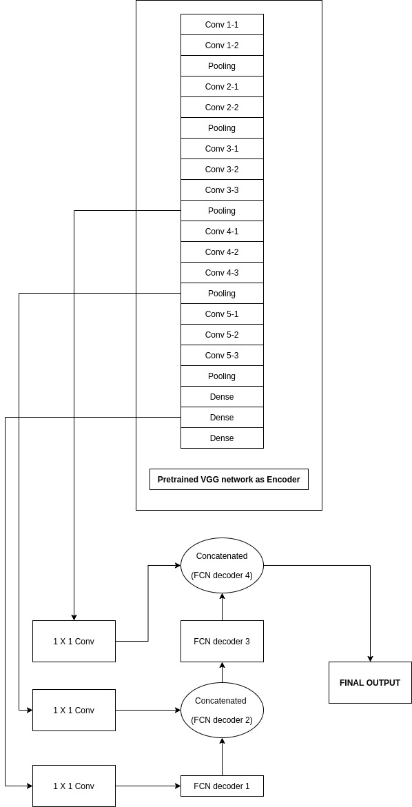

 
In the above shown model, the pretrained VGG-16 networks are used as encoder. The VGG_16 was trained on pretrained on ImageNet for classification. The 
pretrained weights can be found on the link - <a href = "https://s3-us-west-1.amazonaws.com/udacity-selfdrivingcar/vgg.zip">Udacity Self Driving Car</a>

# Files and Folders:

<ol>
  <li><B>Dataset folder : </B>This folder contains the dataset.</li>
  <li><B>Masked Dataset folder : </B>This folder has the dataset in the masked form. The masking was done manually.</li>
  <li><B>Final Showdown folder : </B>This folder has final outputs or predictions by the model.</li>
  <li><B>FCN folder : </B>This folder has all the codes for the model.</li>
  <li><B>FCN_combo folder : <B>This folder contains the codes for both image and video predictions.<li>
  <li><B>Report_and_Results.pdf file : <B>This folder contains the report of the project/<li>
  <li><B>resize_red_masking.py : <B>This file is reponsible for resizing the image and making semanted mask of it.<li>
</ol>

# Installation :

Go to this link to see, how to train and predict from the model --->  <a href = "https://github.com/AYUSH-ISHAN/Road_Segmentation/tree/main/FCN#training--">For images</a> and <a href = "https://github.com/AYUSH-ISHAN/Road_Segmentation/tree/main/FCN_combo#training--">for Videos and Image</a>both predictions.

# Results on sample images:

<table>
  <tr>
    <td align = "center"><B>IMAGE</B></td>
    <td align = "center"><B>MASK</B></td>
    <td align = "center"><B>OUTPUT</B></td>
  </tr>
  <tr>
    <td>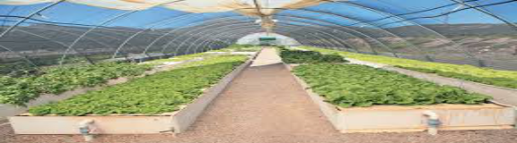</td>
    <td></td>
    <td>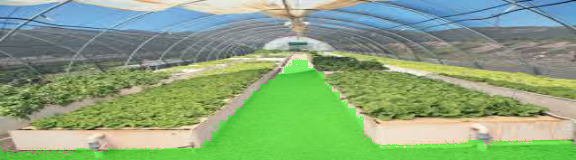</td>
 </tr>
  <tr>
    <td>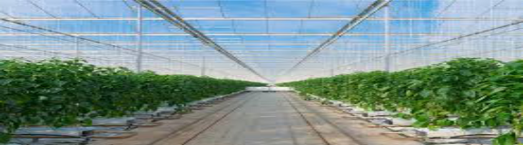</td>
    <td></td>
    <td>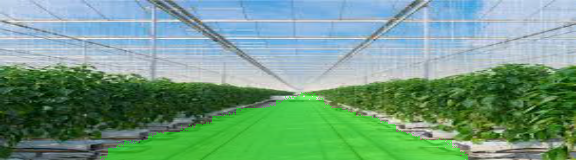</td>
 </tr>
  <tr>
    <td>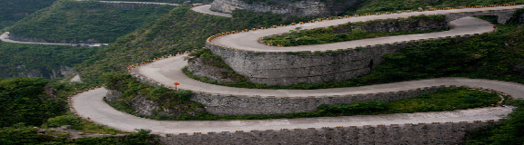</td>
    <td></td>
    <td>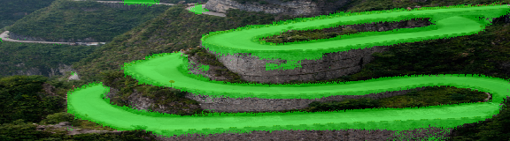</td>
 </tr>
  <tr>
    <td>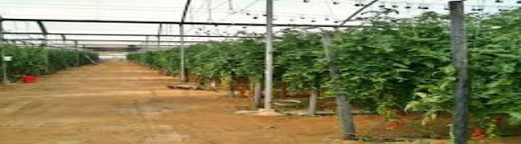</td>
    <td></td>
    <td>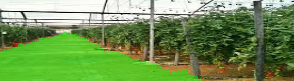</td>
 </tr>
  <tr>
    <td>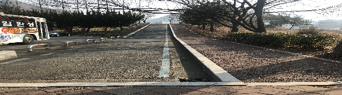</td>
    <td></td>
    <td>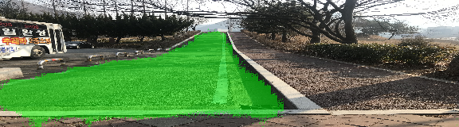</td>
 </tr>
  <tr>
    <td>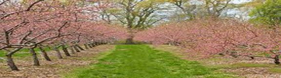</td>
    <td></td>
    <td>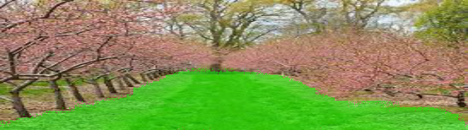</td>
 </tr>
  <tr>
    <td>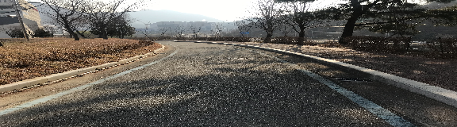</td>
    <td></td>
    <td>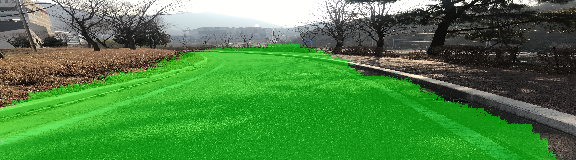</td>
 </tr>
  <tr>
    <td></td>
    <td></td>
    <td></td>
 </tr>
  <tr>
    <td>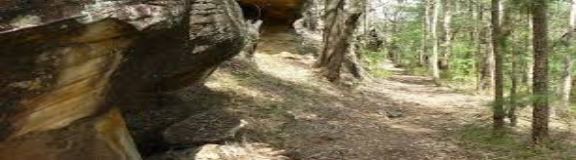</td>
    <td></td>
    <td>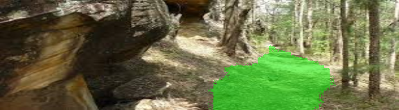</td>
 </tr>
  <tr>
    <td>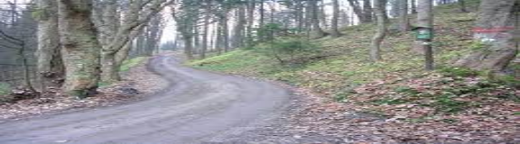</td>
    <td></td>
    <td>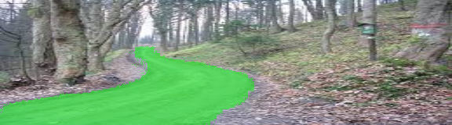</td>
 </tr>
  <tr>
    <td></td>
    <td></td>
    <td>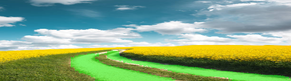</td>
 </tr>
  <tr>
    <td>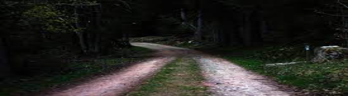</td>
    <td></td>
    <td>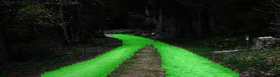</td>
 </tr>
  
 </table>

# Results on sample videos:

    
# References:
<a href = "https://github.com/JunshengFu/semantic_segmentation">Source 1</a> 
<a href = "https://github.com/lb5160482/Road-Semantic-Segmentation/">Source 2</a>
